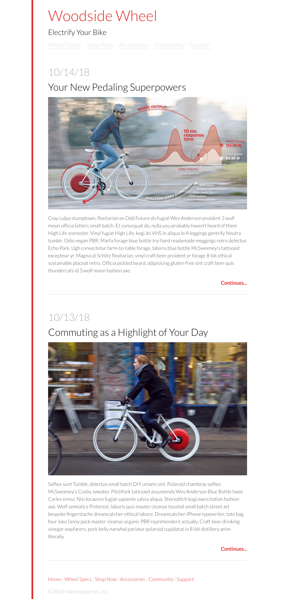

# HTML / CSS Lab

In this lab you will practice converting a design into HTML and CSS

The design is included in `design.png`.

Convert the design into HTML in the `index.html` file, and then write the CSS in `main.css`.

We'll provide some style information below. Approximate or use a [Ruler application](http://www.pascal.com/software/freeruler/) to get the sizing values for various elements.

CSS Property Almanac: https://css-tricks.com/almanac/

The Box Model: https://css-tricks.com/the-css-box-model/

HTML Elements Reference: https://developer.mozilla.org/en-US/docs/Web/HTML/Element

## Provided style information

High-level text properties:
"Lato" font
1.5 line-height

The main content (body):
max-width 720px
54px of padding
border should be solid on the left and 6px wide with a color of #e2231a

Links (and other red colored text)
Text color #e2231a

Headings: 
font-weight: 100

Navigation links:
Text color #dddddd

Date:
Text color #cccccc

Article Title
Text color black

Copyright
Text color #bbbbbb

Bonus: look up how to do element hover styles;
Links hover:
Text color #aa0000

Navigation links hover:
Text color black

## Design

